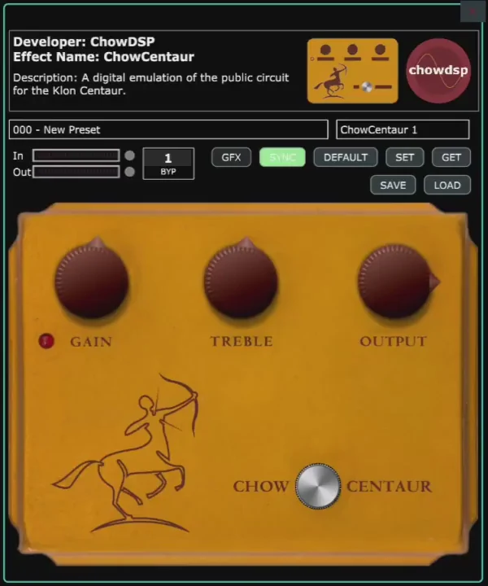

# ChowDSP_ChowCentaur

The ChowCenatur is a digital emulation of the infamous Klon Centaur transparent overdrive. It uses Wave Digital Filters (WDF) for the non-linear components and biquads for the filtering elements.

This version has been ported to the Teensy based Multiverse pedal. It is also available as a free effect download on the Multiverse website.

**Instructions:**
Build the project using the Multiverse Effect Creator tool, then add the generated EFX to your library in the Multiverse Designer.

**Audio Effect Author:**
Jatin Chowdhury
www.chowdsp.com

# License
BSD 3-clause (See LICENSE.txt)

# Reference Links
https://aviateaudio.com/products/multiverse-pedal

http://forum.pjrc.com
